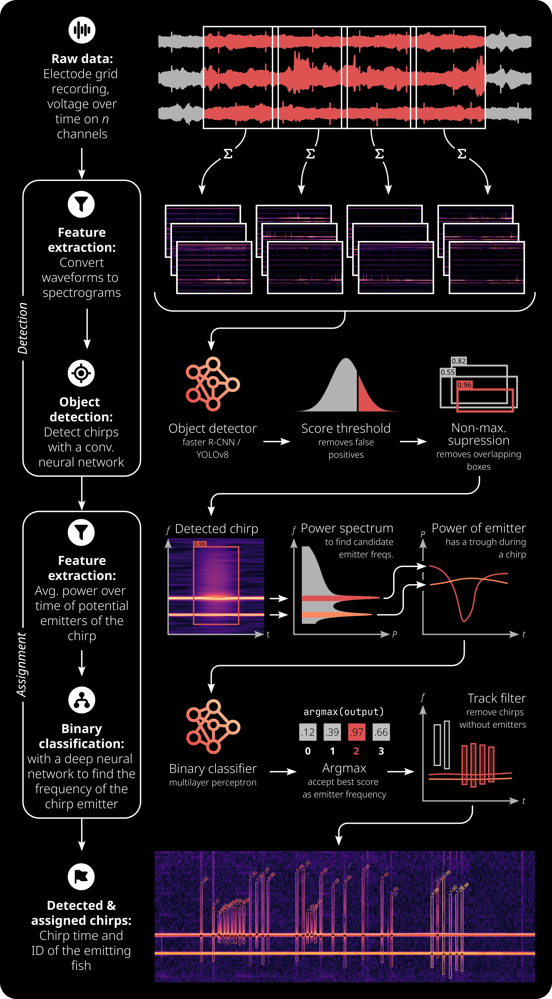

    
    <h1 align="center">Chirpdetector</h2>

Detect communication signals of electric fish using deep neural networks 🐟⚡🧠 

  <a href="https://weygoldt.com/chirpdetector"><strong>Explore the docs »</strong></a>
   
   
  <a href="https://weygoldt.com/chirpdetector/demo">View Demo</a>
  |
  <a href="https://github.com/weygoldt/chirpdetector/issues">Report Bug</a>
  |
  <a href="https://github.com/weygoldt/chirpdetector/issues">Request Feature</a>

**This project is still work in progress and will approximately be released in
summer of 2024.**

---

## The Problem

Chirps are by far the most thoroughly studied communication signal of weakly
electric, probably even all fish. But detecting chirps becomes so hard when
more than one fish is recorded. As a result, most of the research to date
analyzes this signal in isolated individuals. This is **not** good.

## The Solution

To tackle this issue, this package provides a simple tool to detect chirps of
multiple fish. To do so, it uses GPU-accelerated spectrogram computation and
deep neural networks to detect chirps in spectrograms. The package is
designed to be easy to use and to be integrated into existing data analysis
pipelines. Have fun detecting chirps!

## How it Works

The following flowchart illustrates the basic workflow of the pipeline.
It consists of two main steps:

1. Chirp detection: The raw audio data is transformed into a spectrogram and
   then fed into a deep neural network to detect chirps.
2. Chirp assignment: Based on power spectral densities of the frequency components
   of a single chirp, the detected chirps are assigned to individual fish.

