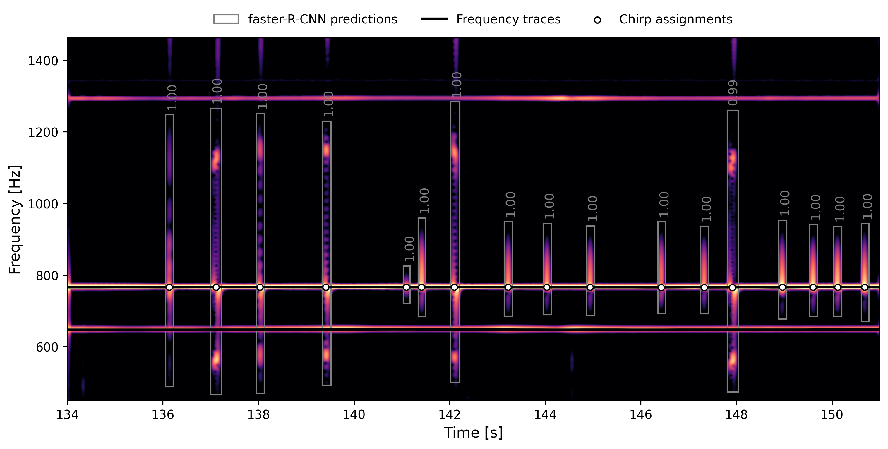

# Detecting chirps with a few terminal commands

Once everything is set up correctly, detecting chirps is a breeze.
The terminal utility can be called by `chirpdetector` or simply `cpd`.

Simply run 
```bash
cpd detect --path "/path/to/dataset"
```
And the bounding boxes will be computed and saved to a `.csv` file. Then run 
```bash
cpd assign --path "/path/to/dataset"
```
to assing each detected chirp to a fundamental frequency of a fish. The results
will be added to the `.csv` file in the dataset. To check if this went well, 
you can run 
```bash
cpd plot --path "/path/to/dataset"
```
And the spectrograms, bounding boxes, and assigned chirps of all the detected 
chirps will be plotted and saved as `.png` images into a subfolder of your
dataset.

The result will look something like this:

<figure markdown>
  { width="auto" }
    <figcaption>15 seconds of a recording containing two chirping fish with bounding boxes around chirps and dots indicating to which frequency they are assigned to.</figcaption>
</figure>
